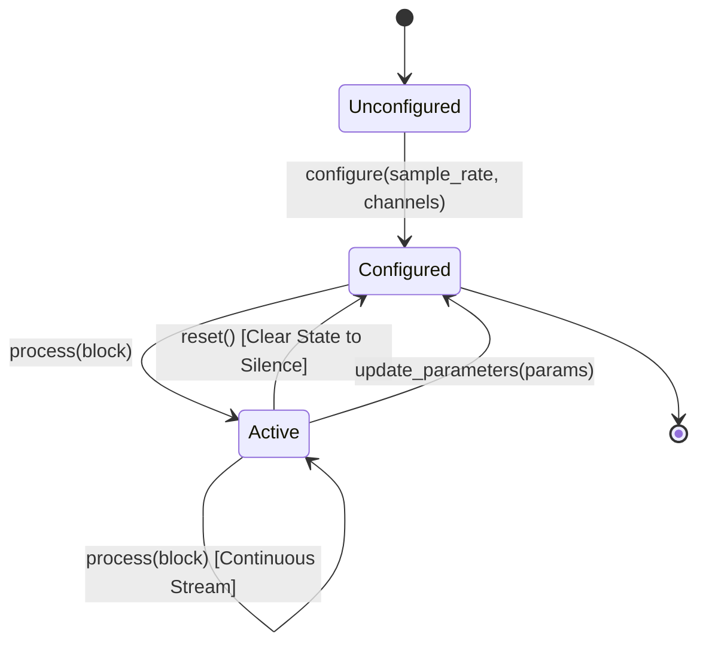

# AcoustiForge — Phase 1A DSP Node Contract Discovery & Architecture Report

**Project:** AcoustiForge  
**Architecture:** ACE — Acoustic Compute Engine  
**Phase:** Phase 1A — DSP Node Contract Discovery & Architecture  
**Governing Authorities:**
1. `prompts/MASTER_PROMPT.md`
2. `docs/contracts/PCM_CONTRACT.md`
3. `docs/contracts/RUNTIME_ARCHITECTURE_AMENDMENT_0_1.md`
4. `docs/ARCHITECTURE.md`
5. `docs/phases/PHASE_0_ACCEPTANCE_REPORT.md`

**Status:** ARCHITECTURAL DISCOVERY RECORD (DISCOVERY-ONLY)

---

## 1. Repository Audit & Baseline Verification

A baseline audit of the repository confirmed:
- **Baseline State:** Clean, verified, 0 untracked files, 0 broken tests.
- **Phase 0 Test Suite:** 58 passed in 0.35s (0 failures, 0 errors, 0 warnings).
- **Core Governance Integrity:** `prompts/MASTER_PROMPT.md`, `PCM_CONTRACT.md`, and `RUNTIME_ARCHITECTURE_AMENDMENT_0_1.md` are intact and verified.
- **Scope Discipline:** Zero DSP filters, EQs, compressors, crossovers, FIR/IIR code, or MCU firmware exist in `src/`.

---

## 2. Phase 1A Objectives & Architectural Context

Phase 0 established the canonical in-memory `float32` planar PCM contract and stateless pass-through. Phase 0.1 established runtime neutrality and storage decoupling.

**Phase 1A Goal:** Define the architectural contract for stateful and stateless digital signal processing (DSP) nodes in the Acoustic Compute Engine (ACE).

The DSP node contract must:
1. Support multi-runtime realization across Python/NumPy, native C/C++, ARM CMSIS-DSP, RISC-V DSP, and MicroPython.
2. Formally separate immutable configuration/parameters from mutable filter state history.
3. Enforce per-channel state isolation to prevent cross-channel contamination.
4. Support dynamic block lengths ($F \ge 1$) with zero memory reallocation on the audio hot path.
5. Provide deterministic lifecycle management (`configure`, `process`, `reset`, `set_parameters`).
6. Enable reference mathematical validation against embedded C kernels.

---

## 3. Core Architectural Principles for DSP Processing Nodes

```
┌────────────────────────────────────────────────────────────────────────┐
│                        ACE DSP Node Architecture                       │
├────────────────────────────────────────────────────────────────────────┤
│ 1. Immutable Node Configuration / Parameters                           │
│    - Filter coefficients (b0, b1, b2, a1, a2), Cutoff (Hz), Q, Gain    │
│    - Read-only during audio block processing; updated out-of-band.    │
├────────────────────────────────────────────────────────────────────────┤
│ 2. Per-Channel State Isolation                                         │
│    - Channel 0 State: Delay line x0[n-1], x0[n-2], y0[n-1], y0[n-2]    │
│    - Channel 1 State: Delay line x1[n-1], x1[n-2], y1[n-1], y1[n-2]    │
│    - State is zero-initialized on reset() and maintained continuously. │
├────────────────────────────────────────────────────────────────────────┤
│ 3. Runtime-Agnostic Processing Boundary                                │
│    - Input: Canonical float32 planar PCMBlock (channels, frames)       │
│    - Output: Canonical float32 planar PCMBlock (channels, frames)      │
│    - Reference Runtime: Pure Python/NumPy vector/loop math             │
│    - Native Runtime: In-place pointer / CMSIS-DSP kernel binding       │
└────────────────────────────────────────────────────────────────────────┘
```

### 3.1 Strict Separation of Parameters and State
- **Node Parameters ($\Theta$):** Define the mathematical transfer function $H(z)$. Examples: filter type (`LowPass`, `Peaking`), center frequency $f_0$, quality factor $Q$, linear/dB gain. Parameters are static during a single block execution and change only when modulated by the user or control graph.
- **Node State ($S_t$):** Memory of past input/output samples across previous frames. Examples: Direct Form I or Direct Form II Transposed delay registers. State is continuously modified frame-by-frame and must persist across block boundaries.

### 3.2 Per-Channel State Independence
For any multi-channel stream $(C > 1)$, each channel $c \in [0, C-1]$ maintains an isolated state vector $S^{(c)}$. Processing Channel 1 must never read, write, or alias the filter state of Channel 0.

---

## 4. Proposed DSP Node Contract Specification

### 4.1 Lifecycle State Machine



1. **Instantiation:** Node is created with initial parameter configuration.
2. **Configuration (`configure(sample_rate, channels)`):**
   - Validates sample rate and channel count.
   - Calculates initial discrete filter coefficients from continuous parameters.
   - Allocates or sizes state buffers for exactly $C$ channels.
   - Clears all state registers to zero.
3. **Execution (`process(block)`):**
   - Validates input block format against configured rate/channels.
   - Transforms samples frame-by-frame using active coefficients and per-channel state registers.
   - Returns transformed canonical `PCMBlock`.
4. **Reset (`reset()`):**
   - Clears all internal state delay registers to zero ($0.0$).
   - Leaves coefficients, parameters, and channel configurations intact.
   - Does not allocate or free memory.

---

## 5. Numerical and Stability Considerations

### 5.1 Direct Form Topology Evaluation
For second-order IIR biquad sections ($H(z) = \frac{b_0 + b_1 z^{-1} + b_2 z^{-2}}{1 + a_1 z^{-1} + a_2 z^{-2}}$):
- Direct Form I (DF-I): 4 state variables per channel.
- Direct Form II Transposed (DF-II-T): 2 state variables per channel, superior float32 precision.

### 5.2 Floating-Point Subnormals (Denormals)
- In recursive IIR filter feedback loops, decay towards silence can produce subnormal numbers ($< 1.18 \times 10^{-38}$).
- Proposed state registers decaying below $10^{-15}$ amplitude be flushed to exact zero ($0.0$) in state maintenance routines.

### 5.3 Filter Stability Invariant
- For all IIR/Biquad configurations, all poles of the discrete transfer function $H(z)$ MUST lie strictly inside the unit circle ($|z_p| < 1.0$).
